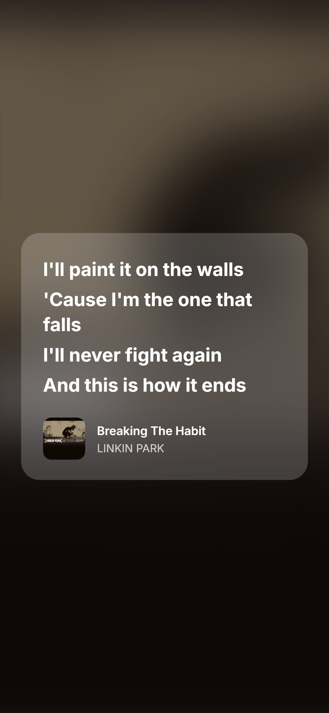
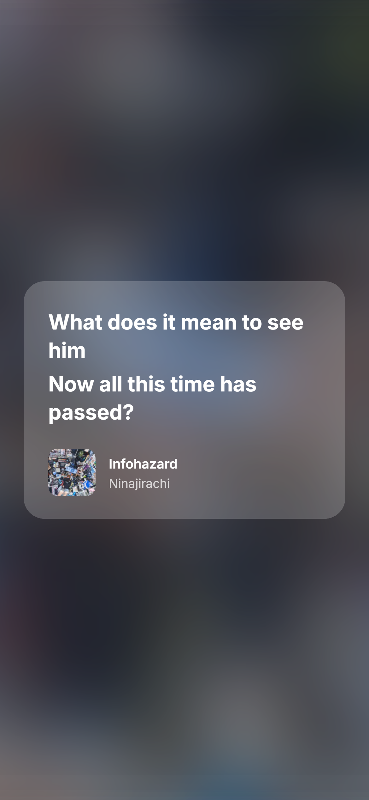

This is a little web app I threw together because I wanted to share songs on Telegram (now that stories are free, finally!).

You search for a song, pick your favorite lyric lines, and it spits out a lyric card image you can post anywhere. It’s nothing fancy, but it works!

## Screenshots

	
	
	

## Some notes (aka excuses)

- I used two APIs for this (LRCLIB for lyrics, iTunes for artwork). Is it the best approach? Nope. But they were free, and this whole thing is a poor man’s solution. 😄
